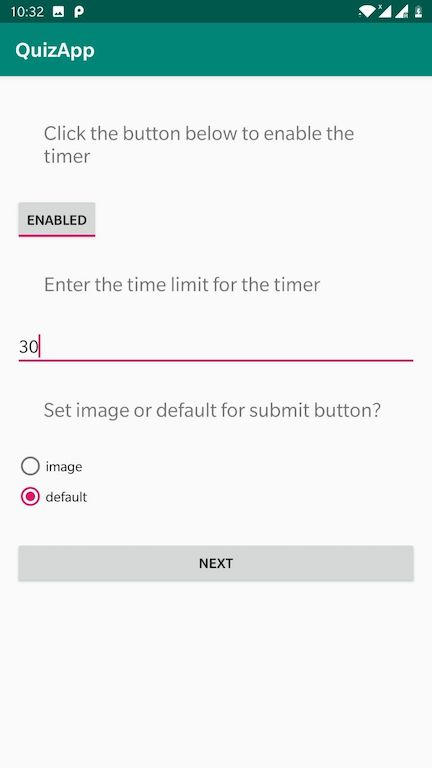
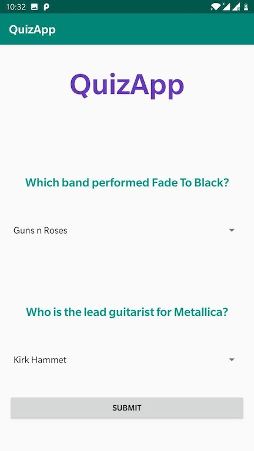
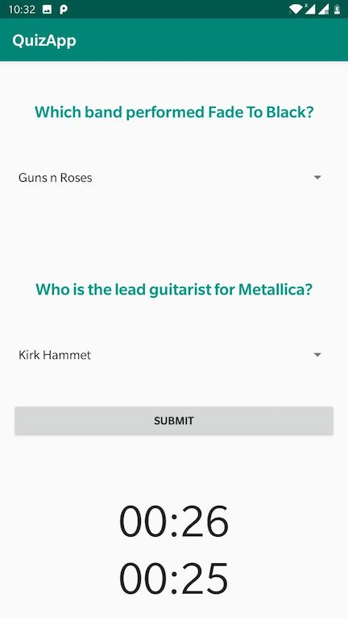

### Quiz App

-The app starts with a configuration page, where the user can set if they want to enable timers or not
They can also set the timeout limit for the timers, and the button(default or image button).

The following is the configuration page with the values just before hitting the next

-Once the next button is clicked , the first activity opens, where a user has to answer two multiple choice questions
Two timers are present, one of them pauses if the app is out of focus, the other one continues. If timeout even occurs
the user fails the quiz and is redirected to the Result screen

-If the user answers the multiple choice questions correctly, then they are taken to the next activity which 
requires the user to answer a fill in the blank question

